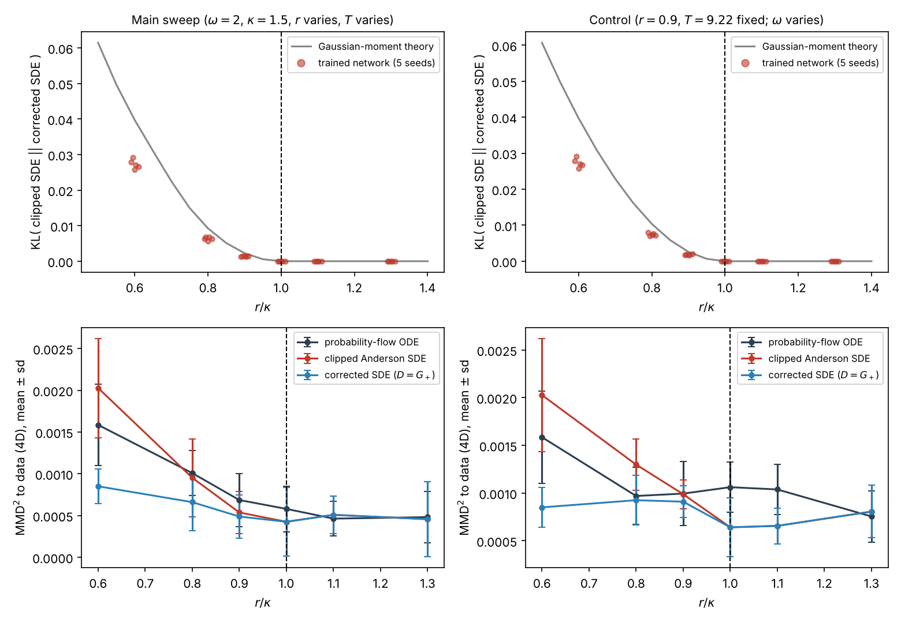
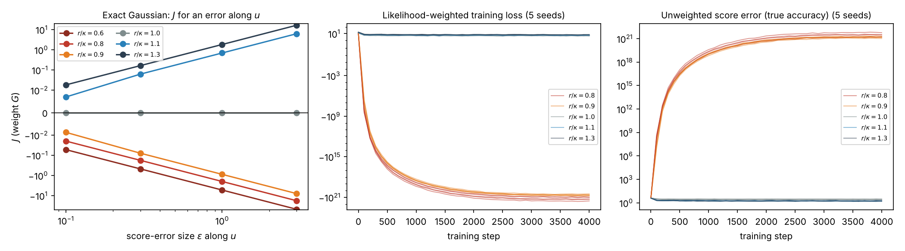
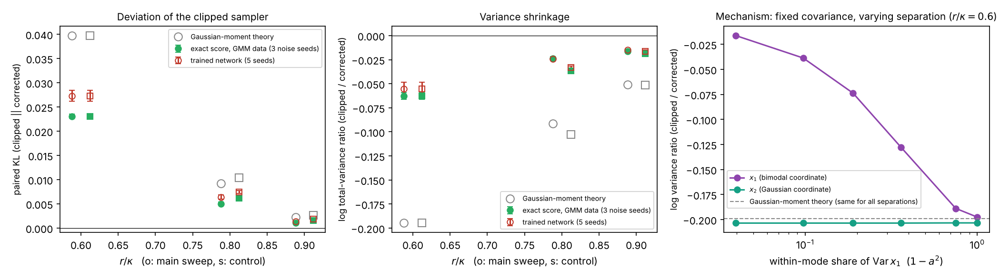

# phase-space-diffusion-threshold

[](https://github.com/neginyan/phase-space-diffusion-threshold/actions/workflows/verify.yml)

Code, results and verification for a study of phase-space diffusion models whose noise schedule is specified by its forward marginals, as an isotropic noise level σ(t)² I.

**Main point.** One threshold, r = κ (r = σ̇/σ, κ = λ_max(Sym B)), simultaneously decides whether the reverse SDE with state-independent noise can be constructed, whether likelihood training is well posed, and whether the coarse-grained arrow of time holds. The individual pieces are known (covariance control, families of reverse SDEs, likelihood weighting, the entropy criterion); the contribution is the structure that connects them and measurements of its consequences in trained models.

## Setting

- Forward law: Z_t = M(t) Z₀ + σ(t) ε, with M(t) = exp(Bt) and σ(t) = σ₀ e^{rt}.
- Required diffusion matrix: G = Ċ − BC − CBᵀ = 2σ²(rI − Sym B).
- G ⪰ 0 ⟺ r ≥ κ = λ_max(Sym B). Below κ the marginals cannot be produced by a linear SDE with drift Bz and state-independent noise, and the Anderson reverse SDE (noise = G) does not exist. Score-corrected, state-dependent dynamics can still produce the same marginals for every r.
- Dynamics: linear Hamiltonian flow B = [[0,1],[−ω²,0]] per coordinate, ω = 2 (κ = 1.5). Data: two moons (positions) with Gaussian momenta, 4-D phase space.

Three reverse samplers, all driven by the same trained score network:

| sampler | drift (forward time) | noise | exact for |
|---|---|---|---|
| probability-flow ODE | Bz − ½ G s | 0 | all r |
| clipped Anderson SDE (G → G₊ in drift and noise) | Bz − G₊ s | √G₊ | r ≥ κ only |
| corrected SDE | Bz − ½ (G + G₊) s | √G₊ | all r |

G₊ is G with negative eigenvalues set to zero. The corrected sampler is a member of the standard family of reverse SDEs with arbitrary diffusion D ⪰ 0.

## What the equations fix and what is measured

That the clipped sampler equals the corrected one for r ≥ κ (so their difference is zero there by construction), and that the deviation starts exactly at r = κ, follow from the equations. The experiments measure what the equations do not fix: the size of the deviation in trained models, its mechanism, whether the corrected sampler works below κ, and how likelihood-weighted training behaves.

## Results (5 seeds)



Left column: main sweep (omega = 2, kappa = 1.5; r and the diffusion time T vary). Right column: control with the absolute widening rate held at r = 0.9 (so T = 9.22 for every point) and omega varied so that r/kappa changes.

- **Top:** paired KL between the clipped and the corrected sampler (same network, prior draw and Brownian increments): 0.0273 ± 0.0011, 0.0064 ± 0.0004, 0.0014 ± 0.0001 at r/κ = 0.6, 0.8, 0.9, about 70 % of the Gaussian-moment prediction. The clipped sampler shrinks the total variance in all 5 seeds at every r < κ.
- **Bottom:** MMD² to the data. The corrected sampler stays accurate below κ (better than the clipped one in 5/5 seeds at 0.6 and 0.8, 4/5 at 0.9).

## Likelihood weighting (continuous-time ELBO)

The weight is W = G/σ² = 2(rI − Sym B); for a scalar drift it reduces to the VDM weight −(log SNR)′. Below κ the Anderson SDE does not exist, so the objective is a formal continuation of the ELBO term.



- **Left (exact Gaussian):** J for a score error along the stretching direction u is positive for r > κ, zero at r = κ and negative (∝ −ε²) below κ.
- **Middle/right (trained network, 5 seeds):** for r < κ the objective decreases without bound and the true score error diverges; for r ≥ κ training converges; at r = κ the zero-weight direction is not learned. A negative value of the objective alone is not evidence (it is defined up to a constant).

## Exact-score reference and mechanism



- A 24-component Gaussian mixture fitted to the data gives exact scores. At equal step counts, the variance shrinkage of the clipped sampler measured with the exact score and with the network differ by 1–14 %; the network's paired KL is 18–27 % above the exact-score value (unresolved).
- Mechanism: the clipped sampler adds attraction toward high density, which shrinks spread within modes but not between them (two-component mixture with fixed covariance, right panel).
- Step size (coupled Brownian paths, three noise seeds): from 4000 steps to the extrapolated limit the paired KL changes by −1.9 % to +2.0 % on average (seed spread ≤ 3.5 %), so it is converged to within a few per cent; the changes of the log-variance ratio (−1.1 % to +9.1 %, spread up to 9.8 %) are not distinguishable from zero.

## Reproduce

```bash
pip install -r requirements.txt
python verification/run_all.py                                   # 113 checks: every analytical statement and number in the paper
cat jobs.txt | xargs -P 2 -L 1 python run_sweep.py               # day-2 jobs (CPU, about 4 min each)
python analyze.py                                                # paired analysis and figure
python elbo_gauss.py                                             # (a) exact Gaussian ELBO check
for s in 0 1 2 3 4; do for r in 0.8 0.9 1.0 1.1 1.3; do python elbo_train.py $s $r; done; done
python elbo_analyze.py
cat jobs_gmm.txt | xargs -P 2 -L 1 python gmm_exact.py          # (b) exact-score reference
cat jobs_mech.txt | xargs -P 2 -L 1 python gmm_mechanism.py     # (b) separation sweep
python gmm_analyze.py
cat jobs_steps_coupled.txt | xargs -P 2 -L 1 python gmm_steps_coupled.py   # step-size study (coupled paths, 3 seeds)
python steps_analyze.py
```

### Environment

All experiments and the verification run used Python 3.13.16 with numpy 2.5.3, scipy 1.18.1, matplotlib 3.11.2 and scikit-learn 1.9.1 (pinned in `requirements.txt`), on Linux (x86_64, glibc 2.39) with a two-core CPU. No GPU and no deep-learning framework are used.

Day-1 jobs: `python run_sweep.py ham <seed> <ratio>` for seeds 0, 1 and ratios 0.6, 0.8, 0.9, 1.0, 1.1, 1.3.
Pure NumPy (score network with hand-written backpropagation and Adam).

## Acknowledgments

The research was carried out with AI assistants: Google Gemini (Gemini 3.8 Flash), OpenAI ChatGPT and Anthropic Claude. The code and experiments in this repository were written with Anthropic Claude.

## License

MIT
